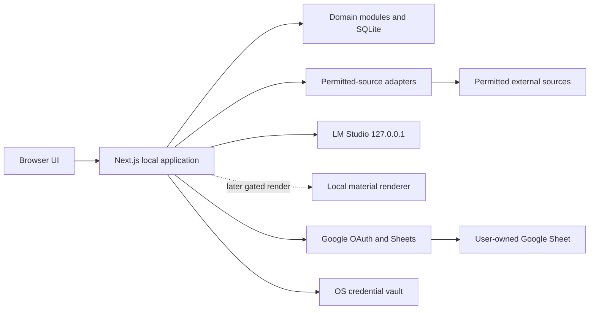
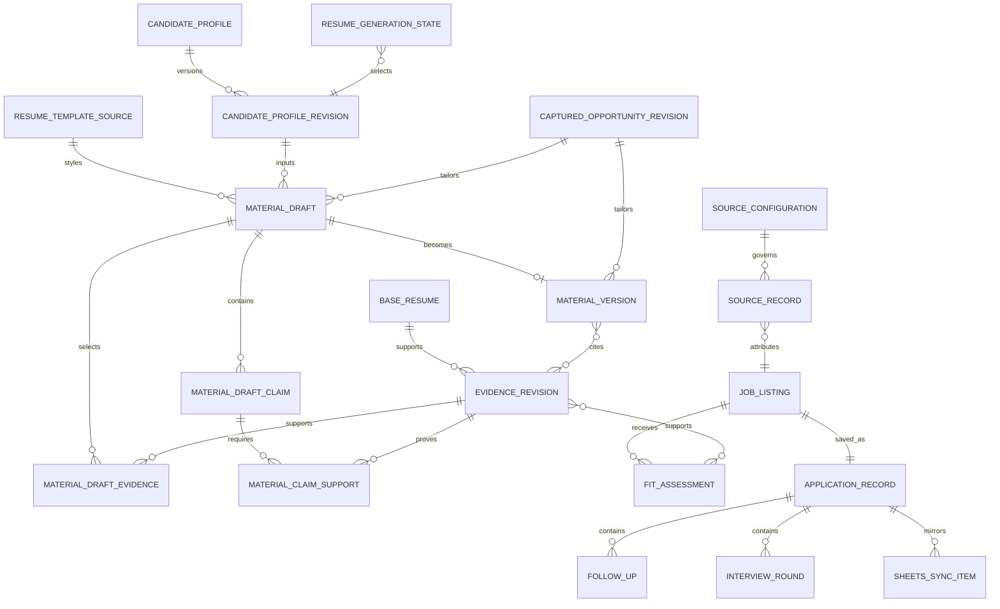
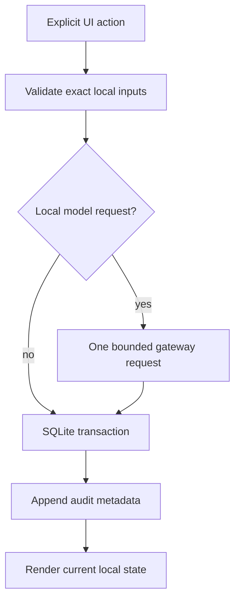

# Architecture Spine — Personal Job Discovery and Application Materials Tool

## Design Paradigm

**Local-first modular monolith.** One Next.js process binds to `127.0.0.1`; SQLite and the private app-data directory are authoritative. Feature modules invoke explicit adapters for permitted sources, LM Studio, local LaTeX, Google OAuth/Sheets, and the OS credential vault. No module starts recurring work.



## Invariants & Rules

### AD-1 — Local-only ownership [ADOPTED]

- **Binds:** all persistence, access, deployment, recovery, OAuth, and audit behavior
- **Prevents:** public exposure, cloud-storage dependency, background service execution, and unauthenticated network access
- **Rule:** Run only on `127.0.0.1`; use SQLite and a private OS-user app-data directory as the authority. There is no product login or public deployment. The OS account and loopback binding replace the PRD's hosted-authentication assumption. External network calls occur only inside an explicit user action.

### AD-2 — Local model boundary [ADOPTED]

- **Binds:** AI generation, Resume Coach consent, configuration, and failure behavior
- **Prevents:** cloud transmission, uncontrolled model-side actions, LAN exposure, and unapproved candidate facts
- **Rule:** Use Qwen3.5-9B through one server-side, stateless `LocalModelGateway` to LM Studio native REST v1 at `http://127.0.0.1:1234/api/v1/chat`. The current setup is bound to `127.0.0.1` and sends no API token. Disable CORS, local-network serving, and every MCP/tool integration. Each request sends `store: false` and omits `previous_response_id`; response IDs are rejected and never persisted. Settings explicitly validates a configured exact LM Studio model identifier against `/api/v1/models` before it may be selected; the user-facing family label is Qwen3.5-9B. Every Coach turn is one explicit request after consent identifies the saved Candidate Profile revision, named approved Evidence revisions, and optional Captured Opportunity revision. Send only those snapshots plus the user request; use no cloud fallback or automatic retry. Persist reviewable prompt/content only as private Material Draft domain data, never in operational logs.

### AD-3 — Evidence-first fit assessment [ADOPTED]

- **Binds:** candidate evidence, job normalization, fit explanation, filtering, and audit history
- **Prevents:** opaque rankings, retrospective label mutation, unsupported matches, and hiring-outcome claims
- **Rule:** Calculate a deterministic, versioned Fit Assessment from approved evidence, job-requirement excerpts, seniority, work-style/location, and freshness. Strong requires substantial supported alignment with no known disqualifier; Potential requires meaningful alignment with a material gap or uncertainty; Stretch requires significant evidence, seniority, or location mismatch. Unknown/stale inputs lower confidence and remain visible. Personal Pursue/Priority never changes the calculated label.

### AD-4 — Claim provenance and export gate [ADOPTED]

- **Binds:** evidence review, local-model outputs, draft editing, approval, and export
- **Prevents:** fabricated claims, loss of provenance, and template mutation
- **Rule:** Each candidate-facing claim must reference one or more approved immutable Evidence revisions and, when tailored, may reference one immutable Captured Opportunity revision. Unreviewed/rejected evidence cannot support a claim. A missing support set is a blocking review outcome; it is never silently repaired. The designated Resume Template is immutable; Material Draft, Material Version, review, and export retain append-only provenance manifests.

### AD-5 — Policy-gated discovery [ADOPTED]

- **Binds:** source setup, manual refresh, rate limiting, errors, normalization, and source retention
- **Prevents:** unauthorized scraping and background retrieval while allowing source-specific permitted fetching
- **Rule:** A Source Configuration records its approved method (official API, published feed, or policy-reviewed HTML retrieval), policy revision/date, request budget, rate limit, retention rule, enabled state, and failure guidance. A user-started Refresh Run only uses enabled adapters and stops a source on throttle, block, or policy uncertainty. No schedules, automatic retries, crawling expansion, credential reuse, proxying, or bypasses. Other sites are browser handoffs with local manual import.

### AD-6 — Local-authoritative Sheets mirror [ADOPTED]

- **Binds:** OAuth, token storage, tracker schema, synchronization, conflicts, and revocation
- **Prevents:** duplicate rows, a second authority, token leakage, and silent loss of edits
- **Rule:** Google Sheets is an explicit mirror. Use a Desktop OAuth client and loopback callback, requesting only `https://www.googleapis.com/auth/spreadsheets`; request neither email/profile nor Drive scope. The user either creates a tracker through the app or pastes a spreadsheet URL/ID, after which the app verifies edit access. Retain refresh tokens solely in the OS credential vault and revoke/delete them locally on disconnect. Stable entity UUID, local revision, prior content hash, and sync time identify each row. Sync is a visible user-triggered attempt and queues failures locally. Remote divergence requires user-confirmed reconciliation; neither side silently overwrites the other. Notes are local-only unless individually opted in.

### AD-7 — Local lifecycle and recovery [ADOPTED]

- **Binds:** retention, deletion, recovery, exports, and lifecycle audit events
- **Prevents:** undiscoverable local data, accidental provenance loss, and implied deletion of third-party copies
- **Rule:** The Data & Storage UI owns scoped export, deletion, restore, and storage usage. Keep active data until the user deletes it; ordinary deletion enters a 30-day local trash, while sensitive content may be permanently deleted after confirmation. Show dependencies before delete and never mutate the Base Resume. Backups remain local to the protected device and rely on the Windows OS-account/full-disk-encryption boundary; the MVP does not create portable or application-encrypted backup archives. Disconnecting Google removes the local token and states that remote Sheet data remains under the user's Google account.

### AD-8 — Versioned structured materials [ADOPTED]

- **Binds:** drafting, formatting, exports, versioning, and auditability
- **Prevents:** formatting drift, model-authored executable document code, export before evidence review, and template overwrite
- **Rule:** `Resume.pdf` is the immutable visual template; the local model returns only the bounded Material Draft JSON contract in AD-13. A later deterministic renderer may consume an accepted Material Version and the pinned template digest, but no renderer is selected by this change and the model may never author PDF, HTML, or TeX. Export remains blocked until explicit review acknowledgement and zero blocking claim-support outcomes.

### AD-9 — Gated local material rendering [ADOPTED]

- **Binds:** export setup, rendering, diagnostics, and recovery
- **Prevents:** environment-specific format drift and loss of an approved draft on render failure
- **Rule:** Epic 8 selects no renderer. A later renderer decision must consume only an accepted Material Version and the pinned `Resume.pdf` template digest, run locally in a version-specific temporary directory, and preserve the approved draft on failure. It cannot consume model-authored document code, mutate a template, render in the cloud, or compile in the background.

### AD-10 — Metadata-only audit trail [ADOPTED]

- **Binds:** audit, privacy, recovery, and operational diagnostics
- **Prevents:** unverifiable state changes and leakage through logs
- **Rule:** Append local audit events for refreshes, evidence review, fit calculation, model generation, approval/export, Sheets sync/reconciliation, OAuth lifecycle, and data recovery/deletion. Store timestamp, local actor, entity/version IDs, action/outcome, and content hashes only—never documents, prompts, model output, tokens, or credentials. The UI shows the history and can include it in local backup within the protected-device boundary.

### AD-11 — Local UI preview and directory-workflow boundary [ADOPTED]

- **Binds:** Resume preview, project-directory selection, and UI-level rendering/disclosure behavior
- **Prevents:** an untrusted document renderer or visual convenience becoming a new data authority, background scan, or cloud transfer path
- **Rule:** UI previews and directory workflows are explicit, local, non-executing, and non-authoritative. The same-origin PDF route serves only a verified designated template byte copy and exposes an open/download fallback; it never renders a Material Draft as though it were the template. They do not load remote assets, run document-supplied code, transmit content, watch folders, or silently fall back to an AI/cloud service. A rendering failure preserves profile and draft state and presents a safe fallback. Existing UI action → domain command → SQLite transaction → audit event boundaries remain unchanged.

## Consistency Conventions

| Concern | Convention |
| --- | --- |
| Identity | UUIDv7 for local entities; never use a visible row number as identity. |
| Time | UTC ISO 8601 in storage and audit; render in the user's local zone. |
| Revision | Immutable content/evidence/material revisions; mutable records use monotonically increasing local revision plus updated timestamp. |
| Provenance | Material Draft/Version → Profile revision + Template digest + Evidence revision(s); tailored draft also → Captured Opportunity revision. Claims → Evidence revision(s) → source document section. |
| Errors | `code`, `summary`, `safe_next_action`, and affected entity/source IDs; preserve successful partial results. |
| Mutations | Ordinary commands: UI action → domain command → SQLite transaction → audit event. Coach commands: validate/consent → one LocalModelGateway request → SQLite transaction → audit event. No adapter is the authority. |
| External data | No tokens or raw sensitive content in logs. Network requests are scoped to the initiating action and adapter policy. |

## Stack

| Name | Version |
| --- | --- |
| Node.js | 24.18.0 LTS |
| TypeScript | 5.9.x |
| Next.js App Router | 16.3.0 |
| SQLite | current stable at implementation; schema migrations are mandatory |
| LM Studio local API | native REST v1 (`/api/v1/*`) |
| Local model | Qwen3.5-9B |
| Material renderer | deferred; must satisfy AD-9 before export implementation |

## Structural Seed





```text
src/
  app/                 # Next.js UI and loopback route handlers
  domain/              # commands, entities, deterministic fit and claim validation
  persistence/         # SQLite schema, transactions, repositories, migrations
  adapters/
    sources/           # one policy-gated adapter per permitted source
    local-model/       # LocalModelGateway and strict response validation
    resume-generation/ # profile, template, drafts, claims, and handoff commands
    google-sheets/     # OAuth, schema, idempotent sync, reconciliation
    material-renderer/  # later deterministic renderer selected under AD-9
    os-vault/          # OAuth and LM Studio token storage
  files/               # app-data, manifests, trash, backup archive handling
  audit/               # append-only metadata events
```

## Capability → Architecture Map

| Capability / Area | Lives in | Governed by |
| --- | --- | --- |
| Candidate profile and Resume template | `domain/resume-generation`, `files`, `persistence` | AD-1, AD-11, AD-13, AD-14 |
| Reviewed Experience & Projects | `domain/evidence`, `files`, `persistence` | AD-1, AD-4, AD-7, AD-13 |
| FR-3–7 preferences, refresh, listings | `domain/discovery`, `adapters/sources` | AD-1, AD-5 |
| FR-8–9 fit explanation | `domain/fit`, `domain/provenance` | AD-3, AD-4 |
| Resume Coach, drafts, and later exports | `adapters/local-model`, `domain/resume-generation`, `domain/claims` | AD-2, AD-4, AD-8, AD-13 |
| FR-13 application tracking | `domain/tracker`, `persistence` | AD-1, AD-6, AD-10 |
| FR-14–15 Google connection and mirror | `adapters/google-sheets`, `adapters/os-vault` | AD-1, AD-6, AD-7 |
| FR-16 external application handoff | `app` outbound-link primitive | AD-1, AD-5 |
| UX status, review, recovery, accessibility | `app` and domain error contracts | AD-3–10, conventions |

## Deferred

| Decision | Revisit when |
| --- | --- |
| Initial permitted-source catalog, exact policies, and request budgets | Before enabling each source adapter; no source is enabled without its record. |
| Local structured-material renderer | Select before material export; it must produce editable source and ATS-readable PDF without TeXworks. |
| Local database/file-at-rest encryption beyond OS account protection | Before use on a shared or unencrypted device. |
| Desktop wrapper | Only if the local browser workflow no longer meets usability needs. |
| Mobile access | Only if local-only ownership and the evidence-review accessibility floor can be preserved. |

## Historical Change - 2026-08-22: Evidence Library and Editable Base Resume

This is retained implementation history. AD-13 and AD-14 supersede its Current Base Resume edit model for the active Resume experience while preserving its local-only, explicit-action, provenance, and review invariants.

- `resume-evidence/` is a user-managed recursive Markdown library. Application reads occur only after an explicit Add, Refresh Library, or Update Base Resume action. A selected external project/document folder is read-only input; copied/approved resume evidence becomes the library content.
- `Resume.pdf` is a locally parsed source version, not an editable file in place. The application persists a structured Current Base Resume draft/version, separate from the source PDF, and retains version references for every Material Version.
- Add Project, Add Experience, and Document for Resume are explicit domain commands. The optional documentation command sends only the selected folder's permitted extracted content to the configured loopback local model, stores no raw model response in audit history, and requires evidence review before persistence/use.
- Replace `adapters/latex` with narrow `adapters/resume-parser`, `adapters/evidence-documenter`, and a later `adapters/material-renderer`. The renderer decision remains gated before Epic 4; it cannot use TeXworks as a required dependency.

## Approved Change - 2026-08-24: Manual Opportunity Capture Boundary

This change supersedes AD-5's discovery/refresh/source-adapter behavior for the MVP while preserving its fail-closed external-access posture.

### AD-12 - Manual Opportunity Capture [ADOPTED]

- **Binds:** Opportunity intake, local structuring, confirmation, attribution, revisions, duplicate suggestions, fit input, Resume Coach context, and outbound application handoff.
- **Prevents:** supplied-URL fetching, scraping, crawling, browser automation, hidden network activity, accidental source-policy claims, and automatic submission.
- **Rule:** An explicit UI action accepts only user-provided posting URL and copied description. A local `OpportunityCapture` command validates bounded input, derives a draft locally, and preserves URL attribution plus capture timestamp. The user confirms/corrects fields before an immutable Opportunity revision is persisted with a metadata-only audit event. Unknown remains unknown. Duplicate suggestions are local and non-destructive. The original URL opens only through an explicit browser handoff.

No `SourceConfiguration`, Refresh Run, source adapter, rate-limit budget, policy registry, or generic HTTP URL fetch participates in the MVP opportunity path. A later company/ATS integration requires a new architecture decision and a source-specific adapter; it cannot be activated by merely pasting a URL.

### AD-13 - Profile-led Resume Generation [ADOPTED]

- **Binds:** Candidate Profile, Resume Template, Resume Coach, Material Draft, Material Version, claim support, and resume-review handoff.
- **Prevents:** manual Current Base Resume editing returning through a new path; one request reading ambient data; mutable profile/template state being attributed retroactively; model-authored document code; and draft output silently becoming an export.
- **Rule:** Candidate Profile revisions, immutable template sources, Material Drafts, Material Versions, and claim-support joins are append-only local records. `Resume.pdf` is the only designated template; its private byte copy and SHA-256 digest are verified before preview and pinned on each draft/version. `LocalModelGateway` is the sole Coach path and returns only the bounded JSON contract below. A Coach request names the exact saved profile revision, reviewed evidence revisions, and optional opportunity revision in its consent panel; a new selection invalidates consent. A generated draft remains pending until **Use as draft** creates the review handoff. Rendering, claim validation, approval, and export remain separate gates.

### AD-14 - Forward-only Current Base Resume compatibility [ADOPTED]

- **Binds:** migration, legacy repositories/routes, template bootstrap, UI replacement, and historical data access.
- **Prevents:** destructive conversion of reconstructed text into generated material; a legacy import becoming the designated template without byte verification; and split authority between legacy and profile-led records.
- **Rule:** Migration `0021_resume_profile_materials` adds the Profile-led tables without altering or deleting `current_base_resume_*` tables or their files. It inserts immutable template-candidate metadata for each retained legacy source, but only the bundled `Resume.pdf` bootstrap command may create the first designated template after copying and digest-verifying its bytes into private app data. Legacy sources, drafts, proposals, and versions remain read-only history. New Resume Edit routes and actions must use only the Profile-led repositories; the prior manual-editor server actions and write routes are disabled with a safe legacy-history response and cannot produce a Material Draft or Material Version.

### AD-15 - AI-grounded opportunity assessment [ADOPTED]

- **Binds:** Captured Opportunity assessment, fit provenance, LocalModelGateway reuse, caching, Pursue/Priority, and Jobs detail.
- **Prevents:** keyword-only pseudo-understanding, unpinned assessment inputs, model tools/fallback/retry, repeated identical inference, prompt/response logging, and AI-controlled application action.
- **Rule:** Story 8.3's `LocalModelGateway` is the sole stateless loopback route for an explicit assessment request. A distinct, bounded assessment JSON schema accepts only the exact selected profile/evidence summaries and a Captured Opportunity revision; it returns strengths, gaps/uncertainty, references by selected-evidence index, and short excerpts by captured revision offsets. The app validates all references before persisting an immutable assessment with its input fingerprint, model configuration fingerprint, and prompt/schema version. An identical fingerprint reuses the stored result without inference. Deterministic Unknown/stale and explicit seniority/location/work-style disclosures remain visible but do not determine semantic fit. Pursue/Priority is an append-only local decision separate from the assessment. No URL fetch, model tool/MCP, cloud fallback, automatic retry, or prompt/response audit logging is allowed.

## Profile-led Resume Implementation Contract

### Schema and migration seed

Migration `0021_resume_profile_materials.sql` is one transactional, forward-only SQLite migration. It follows the existing `node:sqlite` migration runner and registers after `0020_captured_opportunity_url_constraint`.

| Table | Required ownership and constraints |
| --- | --- |
| `candidate_profiles` | Immutable UUIDv7 aggregate root and creation timestamp. One local profile is selected through `resume_generation_state`; prior roots are retained. |
| `candidate_profile_revisions` | UUIDv7, profile FK, linear revision number and parent FK; required `first_name`, `last_name`, `email`, `phone_number`, `school`, `program`, and `graduation_year`; nullable `middle_name`, `gwa`, `latin_honors`, `linkedin_url`, and `github_url`; canonical JSON/digest and timestamp. Immutable insert-only rows with a same-profile/linear-parent trigger. |
| `resume_template_sources` | UUIDv7, `origin` (`bundled` or `legacy_current_base_resume`), display filename, SHA-256 digest, byte size, private relative storage location, optional legacy-source FK, and timestamp. Every row is immutable; bundled locations must stay below `resume-templates/`, legacy candidates only reference an existing immutable legacy source. |
| `local_model_configuration_revisions` | Immutable UUIDv7 configuration records: fixed loopback endpoint, required exact validated model identifier plus Qwen3.5-9B display label, OS-vault secret reference (never a token), configuration fingerprint/digest, and timestamp. The migration does not import `LM_STUDIO_*` environment values; Settings creates the first revision deliberately. |
| `resume_generation_state` | Singleton mutable pointer with `current_profile_revision_id`, `designated_template_source_id`, `local_model_configuration_revision_id`, monotonic `revision_number`, and timestamp. The migration creates its one row with null pointers; commands compare-and-swap `revision_number`. It is the only current-selection record; FKs and a trigger require a bundled, verified template for `designated_template_source_id`. Re-designation is an explicit CAS update and affects only later drafts. |
| `material_drafts` | UUIDv7, `kind = resume`, profile-revision FK plus profile digest snapshot, template-source FK plus template digest snapshot, optional captured-opportunity-revision FK/digest snapshot, private user-request text/digest, validated `content_json`, content/provenance digests, and timestamp. Immutable; no input snapshot is ever replaced. |
| `material_draft_evidence` | Immutable draft/evidence join. Insert is allowed only for an approved Evidence revision; the command also selects only current reviewed Experience & Projects material. |
| `material_draft_claims` and `material_claim_support` | Immutable normalized claims and claim-to-approved-evidence joins. Claim ordinals are unique per draft; a review command blocks any claim without at least one support row. |
| `material_draft_handoffs` | Immutable UUIDv7 record created only by **Use as draft**. It references one pending draft and records the review-flow destination; unique draft FK prevents duplicate handoff. |
| `material_versions` | Immutable future review/export record: UUIDv7, source draft FK, explicit profile/template/opportunity digest snapshots, accepted timestamp, content/provenance digests, and nullable renderer/export metadata. No version is created by Resume Edit itself. |

The migration only backfills legacy template candidates from `current_base_resume_sources`; it does not parse, copy, transform, or designate reconstructed Current Base Resume draft text. The existing runner wraps each SQL file and its `schema_migrations` record in its own `BEGIN IMMEDIATE` transaction, so `0021` contains database-only DDL/backfill. A later explicit template bootstrap copies repository `Resume.pdf` to an unreferenced `resume-templates/.staging/<template-id>` path, hashes and validates it, atomically renames it to `resume-templates/<template-id>/Resume.pdf`, then inserts the immutable bundled-template row and CAS designation in one SQLite transaction. Startup and bootstrap recovery remove abandoned staging paths and fail closed when a designated row's byte copy or digest is missing; they never guess a replacement template.

### Repository and command boundaries

| Boundary | Owns | May call |
| --- | --- | --- |
| `candidate-profile-repository` | profile roots, immutable revisions, current-profile selection | SQLite transaction only |
| `resume-template-repository` | template metadata, current designation, legacy-candidate links | private file staging/verification through `files/resume-template` |
| `material-draft-repository` | drafts, selected evidence, claims, support joins, review handoff | SQLite transaction only |
| `material-version-repository` | accepted/reviewed versions and later render/export metadata | SQLite transaction only |
| `local-model-configuration-repository` | immutable configuration revisions and singleton selection; OS-vault reference only | SQLite transaction and `adapters/os-vault` |
| `domain/resume-generation` | profile validation, exact input snapshot, consent token invalidation, draft validation, and review handoff | repositories, evidence/opportunity read models, audit |
| `adapters/local-model/LocalModelGateway` | one bounded stateless LM Studio native-v1 request and JSON decoding | server-side OS-vault token lookup and `fetch` only; never repositories, files, browser state, or network fallback |

The command flow is: save Profile revision → select reviewed Evidence and optional Opportunity → display exact consent → submit one Coach request → validate bounded JSON and every claim support reference → transactionally persist one Material Draft and metadata-only audit event → optionally create a review handoff. The external request is never inside an open SQLite transaction; if it fails, no partial draft is stored and the retained prompt/profile selection stays local for retry.

### LocalModelGateway contract

The gateway receives an immutable `CoachRequest` with `configurationRevision`, `profileRevision`, `evidence[]`, optional `opportunityRevision`, `userRequest`, and `consentFingerprint`. It obtains the token from the configuration's OS-vault reference on the server; no component props, server action return, database row, or audit event contains the token. It rejects absent/changed consent, a configuration not pinned to `127.0.0.1:1234`, a model identifier not previously validated in Settings, missing required profile fields, non-approved evidence, malformed UUIDv7/digest values, and payloads over the command's bounded size before any network call. Its only request target is the fixed loopback native endpoint and its JSON body contains no `integrations`, tool definition, URL, filesystem path, credential, or unselected data.

It accepts only a JSON object with `schemaVersion: 1`, bounded `sections[]`, bounded `claims[]`, `unknowns[]`, and `selectionEcho` equal to the request fingerprint. Every candidate-facing claim has a non-empty, deduplicated list of selected-evidence indexes; the application generates claim IDs, resolves indexes to selected approved revisions, and inserts every required `material_claim_support` row in the draft transaction. A response with any unresolvable or unsupported claim is rejected as a whole rather than persisted in a partial state. Strings are plain text with control characters rejected. Invalid, timed-out, unavailable, or non-JSON responses produce one safe error and no retry, audit payload body, or partial Material Draft.

### Consent, preview, and audit boundary

`consentFingerprint = SHA-256(profile revision digest + sorted evidence revision digests + optional opportunity revision digest + template digest + local-model configuration fingerprint + SHA-256(user request))`. The UI shows readable selected field/material names; it identifies LM Studio on this device and the configured model but does not expose IDs, digests, tokens, or raw adapter diagnostics. Consent is valid for exactly one submission and is invalidated by any changed profile, material, opportunity, template, local-model configuration, or user request.

The existing OpenAI-compatible Evidence Documenter is not a Coach compatibility path and cannot create Profile-led drafts. It remains limited to its explicit Experience & Projects documentation command until separately migrated; before any future release that keeps it enabled, its local model configuration must be converted to the same vault-backed, token-required loopback settings or the command must be unavailable.

The native PDF route verifies and serves only the designated template bytes with `Content-Type: application/pdf`, `Content-Disposition: inline`, same-origin headers, and a visible open/download fallback. It never accepts a filesystem path or source URL. Audit actions are metadata-only: `resume.profile_saved`, `resume.template_designated`, `resume.coach_requested`, `resume.coach_failed`, `resume.material_draft_created`, `resume.material_draft_handed_off`, `resume.material_version_approved`, `resume.rendered`, and `resume.exported`; they record UUIDv7 entity IDs and SHA-256 hashes only.
