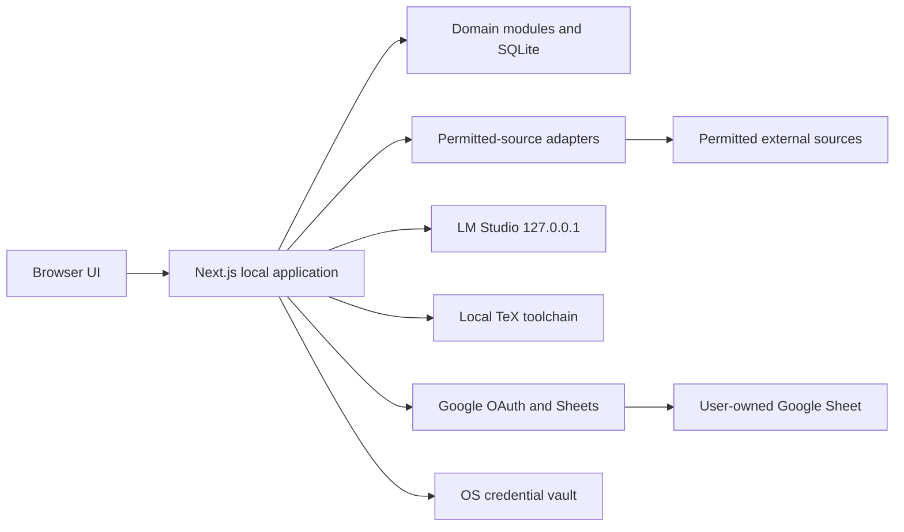
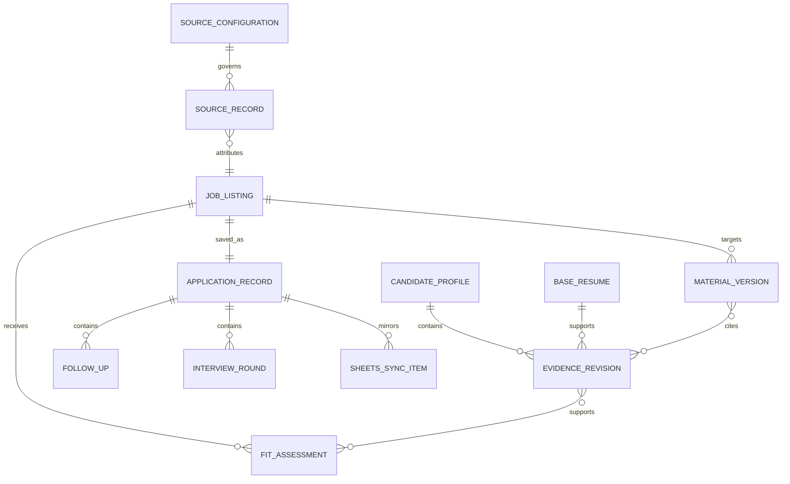
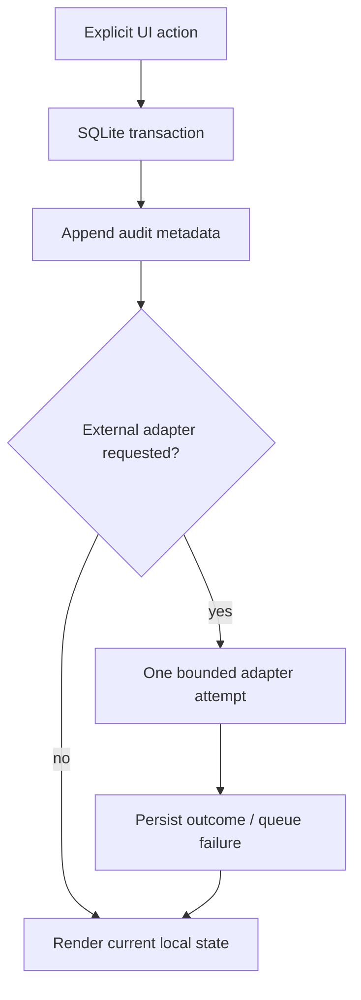

# Architecture Spine — Personal Job Discovery and Application Materials Tool

## Design Paradigm

**Local-first modular monolith.** One Next.js process binds to `127.0.0.1`; SQLite and the private app-data directory are authoritative. Feature modules invoke explicit adapters for permitted sources, LM Studio, local LaTeX, Google OAuth/Sheets, and the OS credential vault. No module starts recurring work.



## Invariants & Rules

### AD-1 — Local-only ownership [ADOPTED]

- **Binds:** all persistence, access, deployment, recovery, OAuth, and audit behavior
- **Prevents:** public exposure, cloud-storage dependency, background service execution, and unauthenticated network access
- **Rule:** Run only on `127.0.0.1`; use SQLite and a private OS-user app-data directory as the authority. There is no product login or public deployment. The OS account and loopback binding replace the PRD's hosted-authentication assumption. External network calls occur only inside an explicit user action.

### AD-2 — Local model boundary [ADOPTED]

- **Binds:** AI generation, privacy, consent, configuration, and failure behavior
- **Prevents:** cloud transmission, uncontrolled model-side actions, LAN exposure, and unapproved candidate facts
- **Rule:** Use Qwen3.5-9B through one server-side `LocalModelGateway` to LM Studio on `127.0.0.1`. Require an LM Studio API token; disable CORS, local-network serving, model tools/MCP, cloud fallback, and automatic retries. Before first generation and after any model/endpoint change, show the local endpoint, model, and exact selected data categories; generation needs an explicit request. Every isolated request contains only the selected listing and explicitly approved evidence. Do not persist request/response bodies as logs.

### AD-3 — Evidence-first fit assessment [ADOPTED]

- **Binds:** candidate evidence, job normalization, fit explanation, filtering, and audit history
- **Prevents:** opaque rankings, retrospective label mutation, unsupported matches, and hiring-outcome claims
- **Rule:** Calculate a deterministic, versioned Fit Assessment from approved evidence, job-requirement excerpts, seniority, work-style/location, and freshness. Strong requires substantial supported alignment with no known disqualifier; Potential requires meaningful alignment with a material gap or uncertainty; Stretch requires significant evidence, seniority, or location mismatch. Unknown/stale inputs lower confidence and remain visible. Personal Pursue/Priority never changes the calculated label.

### AD-4 — Claim provenance and export gate [ADOPTED]

- **Binds:** evidence review, local-model outputs, draft editing, approval, and export
- **Prevents:** fabricated claims, loss of provenance, and Base Resume mutation
- **Rule:** Each candidate-facing claim must reference approved immutable Evidence revisions and, when tailored, a short Job Listing excerpt. Unreviewed/rejected evidence cannot support a claim. A missing support set is a blocking warning; it is never silently repaired. The Base Resume is immutable; draft, approval, and export retain append-only provenance manifests.

### AD-5 — Policy-gated discovery [ADOPTED]

- **Binds:** source setup, manual refresh, rate limiting, errors, normalization, and source retention
- **Prevents:** unauthorized scraping and background retrieval while allowing source-specific permitted fetching
- **Rule:** A Source Configuration records its approved method (official API, published feed, or policy-reviewed HTML retrieval), policy revision/date, request budget, rate limit, retention rule, enabled state, and failure guidance. A user-started Refresh Run only uses enabled adapters and stops a source on throttle, block, or policy uncertainty. No schedules, automatic retries, crawling expansion, credential reuse, proxying, or bypasses. Other sites are browser handoffs with local manual import.

### AD-6 — Local-authoritative Sheets mirror [ADOPTED]

- **Binds:** OAuth, token storage, tracker schema, synchronization, conflicts, and revocation
- **Prevents:** duplicate rows, a second authority, token leakage, and silent loss of edits
- **Rule:** Google Sheets is an explicit mirror. Use a Desktop OAuth client and loopback callback, requesting only `https://www.googleapis.com/auth/spreadsheets`; request neither email/profile nor Drive scope. The user either creates a tracker through the app or pastes a spreadsheet URL/ID, after which the app verifies edit access. Retain refresh tokens solely in the OS credential vault and revoke/delete them locally on disconnect. Stable entity UUID, local revision, prior content hash, and sync time identify each row. Sync is a visible user-triggered attempt and queues failures locally. Remote divergence requires user-confirmed reconciliation; neither side silently overwrites the other. Notes are local-only unless individually opted in.

### AD-7 — Local lifecycle and recovery [ADOPTED]

- **Binds:** retention, deletion, recovery, exports, and lifecycle audit events
- **Prevents:** undiscoverable local data, accidental provenance loss, and implied deletion of third-party copies
- **Rule:** The Data & Storage UI owns scoped export, deletion, restore, and storage usage. Keep active data until the user deletes it; ordinary deletion enters a 30-day local trash, while sensitive content may be permanently deleted after confirmation. Show dependencies before delete and never mutate the Base Resume. Backups remain local to the protected device and rely on the Windows OS-account/full-disk-encryption boundary; the MVP does not create portable or application-encrypted backup archives. Disconnecting Google removes the local token and states that remote Sheet data remains under the user's Google account.

### AD-8 — Versioned LaTeX materials [ADOPTED]

- **Binds:** drafting, formatting, exports, versioning, and auditability
- **Prevents:** formatting drift, model-authored executable TeX, export before evidence review, and Base Resume overwrite
- **Rule:** `resume.tex` is the immutable Base Resume template. A matched `cover-letter.tex` uses the same document style. The model returns structured content only; a deterministic renderer escapes it into versioned template copies. After review acknowledgement and zero blocking warnings, export a new immutable Material Version containing `.tex`, PDF, template digest, content manifest, and provenance manifest.

### AD-9 — Local TeX rendering [ADOPTED]

- **Binds:** export setup, rendering, diagnostics, and recovery
- **Prevents:** environment-specific format drift and loss of an approved draft on render failure
- **Rule:** Use the local LaTeX toolchain configured for TeXworks. First-run setup validates the discovered/selected compiler against the Base Resume and records a non-secret toolchain fingerprint. Compile in a version-specific temporary work directory with escaped structured input. Preserve the approved draft on failure and expose actionable diagnostics. No cloud renderer or background compilation.

### AD-10 — Metadata-only audit trail [ADOPTED]

- **Binds:** audit, privacy, recovery, and operational diagnostics
- **Prevents:** unverifiable state changes and leakage through logs
- **Rule:** Append local audit events for refreshes, evidence review, fit calculation, model generation, approval/export, Sheets sync/reconciliation, OAuth lifecycle, and data recovery/deletion. Store timestamp, local actor, entity/version IDs, action/outcome, and content hashes only—never documents, prompts, model output, tokens, or credentials. The UI shows the history and can include it in local backup within the protected-device boundary.

### AD-11 — Local UI preview and directory-workflow boundary [ADOPTED]

- **Binds:** Resume preview, project-directory selection, and UI-level rendering/disclosure behavior
- **Prevents:** an untrusted document renderer or visual convenience becoming a new data authority, background scan, or cloud transfer path
- **Rule:** UI previews and directory workflows are explicit, local, non-executing, and non-authoritative. They do not load remote assets, run document-supplied code, transmit content, watch folders, or silently fall back to an AI/cloud service. A rendering failure preserves local edits and presents a safe text/failure view. Existing UI action → domain command → SQLite transaction → audit event boundaries remain unchanged.

## Consistency Conventions

| Concern | Convention |
| --- | --- |
| Identity | UUIDv7 for local entities; never use a visible row number as identity. |
| Time | UTC ISO 8601 in storage and audit; render in the user's local zone. |
| Revision | Immutable content/evidence/material revisions; mutable records use monotonically increasing local revision plus updated timestamp. |
| Provenance | Claim → Evidence revision(s) → source document section; tailored claim also → Job Listing excerpt and source URL. |
| Errors | `code`, `summary`, `safe_next_action`, and affected entity/source IDs; preserve successful partial results. |
| Mutations | UI action → domain command → SQLite transaction → audit event → optional visible adapter attempt. No adapter is the authority. |
| External data | No tokens or raw sensitive content in logs. Network requests are scoped to the initiating action and adapter policy. |

## Stack

| Name | Version |
| --- | --- |
| Node.js | 24.18.0 LTS |
| TypeScript | 5.9.x |
| Next.js App Router | 16.1.x |
| SQLite | current stable at implementation; schema migrations are mandatory |
| LM Studio local API | native REST v1 (`/api/v1/*`) |
| Local model | Qwen3.5-9B |
| LaTeX renderer | TeXworks-configured local toolchain |

## Structural Seed





```text
src/
  app/                 # Next.js UI and loopback route handlers
  domain/              # commands, entities, deterministic fit and claim validation
  persistence/         # SQLite schema, transactions, repositories, migrations
  adapters/
    sources/           # one policy-gated adapter per permitted source
    lm-studio/         # LocalModelGateway
    google-sheets/     # OAuth, schema, idempotent sync, reconciliation
    latex/              # template renderer and TeXworks compiler adapter
    os-vault/          # OAuth and LM Studio token storage
  files/               # app-data, manifests, trash, backup archive handling
  audit/               # append-only metadata events
```

## Capability → Architecture Map

| Capability / Area | Lives in | Governed by |
| --- | --- | --- |
| FR-1–2 candidate evidence / Base Resume | `domain/evidence`, `files`, `persistence` | AD-1, AD-4, AD-7 |
| FR-3–7 preferences, refresh, listings | `domain/discovery`, `adapters/sources` | AD-1, AD-5 |
| FR-8–9 fit explanation | `domain/fit`, `domain/provenance` | AD-3, AD-4 |
| FR-10–12 drafts and exports | `adapters/lm-studio`, `domain/claims`, `adapters/latex` | AD-2, AD-4, AD-8, AD-9 |
| FR-13 application tracking | `domain/tracker`, `persistence` | AD-1, AD-6, AD-10 |
| FR-14–15 Google connection and mirror | `adapters/google-sheets`, `adapters/os-vault` | AD-1, AD-6, AD-7 |
| FR-16 external application handoff | `app` outbound-link primitive | AD-1, AD-5 |
| UX status, review, recovery, accessibility | `app` and domain error contracts | AD-3–10, conventions |

## Deferred

| Decision | Revisit when |
| --- | --- |
| Initial permitted-source catalog, exact policies, and request budgets | Before enabling each source adapter; no source is enabled without its record. |
| Local structured-material renderer | Select before material export; it must produce editable source and ATS-readable PDF without TeXworks. |
| Local database/file-at-rest encryption beyond OS account protection | Before use on a shared or unencrypted device. |
| Desktop wrapper | Only if the local browser workflow no longer meets usability needs. |
| Mobile access | Only if local-only ownership and the evidence-review accessibility floor can be preserved. |

## Approved Change - 2026-08-22: Evidence Library and Editable Base Resume

The following decisions supersede AD-8's immutable `resume.tex` / TeXworks implementation details while preserving local-only, explicit-action, provenance, and review invariants.

- `resume-evidence/` is a user-managed recursive Markdown library. Application reads occur only after an explicit Add, Refresh Library, or Update Base Resume action. A selected external project/document folder is read-only input; copied/approved resume evidence becomes the library content.
- `Resume.pdf` is a locally parsed source version, not an editable file in place. The application persists a structured Current Base Resume draft/version, separate from the source PDF, and retains version references for every Material Version.
- Add Project, Add Experience, and Document for Resume are explicit domain commands. The optional documentation command sends only the selected folder's permitted extracted content to the configured loopback local model, stores no raw model response in audit history, and requires evidence review before persistence/use.
- Replace `adapters/latex` with narrow `adapters/resume-parser`, `adapters/evidence-documenter`, and a later `adapters/material-renderer`. The renderer decision remains gated before Epic 4; it cannot use TeXworks as a required dependency.

## Approved Change - 2026-08-24: Manual Opportunity Capture Boundary

This change supersedes AD-5's discovery/refresh/source-adapter behavior for the MVP while preserving its fail-closed external-access posture.

### AD-12 - Manual Opportunity Capture [ADOPTED]

- **Binds:** Opportunity intake, local structuring, confirmation, attribution, revisions, duplicate suggestions, fit input, Resume Coach context, and outbound application handoff.
- **Prevents:** supplied-URL fetching, scraping, crawling, browser automation, hidden network activity, accidental source-policy claims, and automatic submission.
- **Rule:** An explicit UI action accepts only user-provided posting URL and copied description. A local `OpportunityCapture` command validates bounded input, derives a draft locally, and preserves URL attribution plus capture timestamp. The user confirms/corrects fields before an immutable Opportunity revision is persisted with a metadata-only audit event. Unknown remains unknown. Duplicate suggestions are local and non-destructive. The original URL opens only through an explicit browser handoff.

No `SourceConfiguration`, Refresh Run, source adapter, rate-limit budget, policy registry, or generic HTTP URL fetch participates in the MVP opportunity path. A later company/ATS integration requires a new architecture decision and a source-specific adapter; it cannot be activated by merely pasting a URL.
